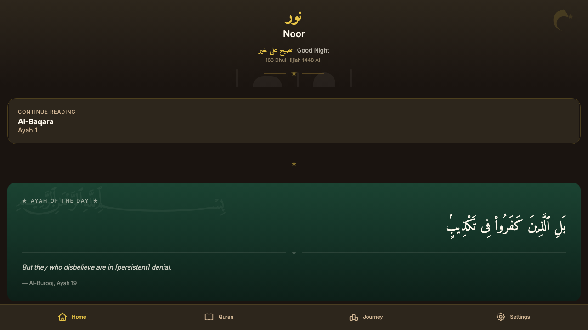
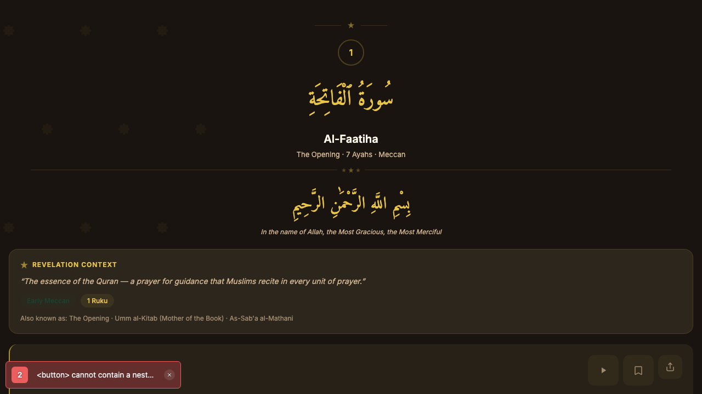
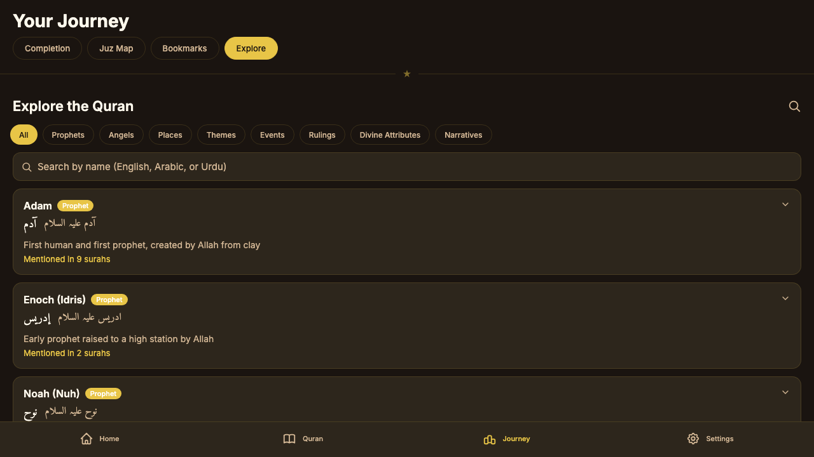
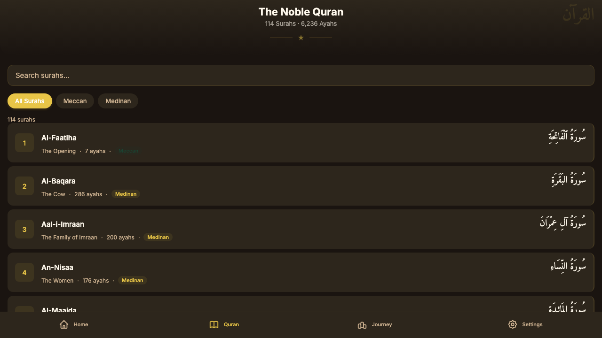
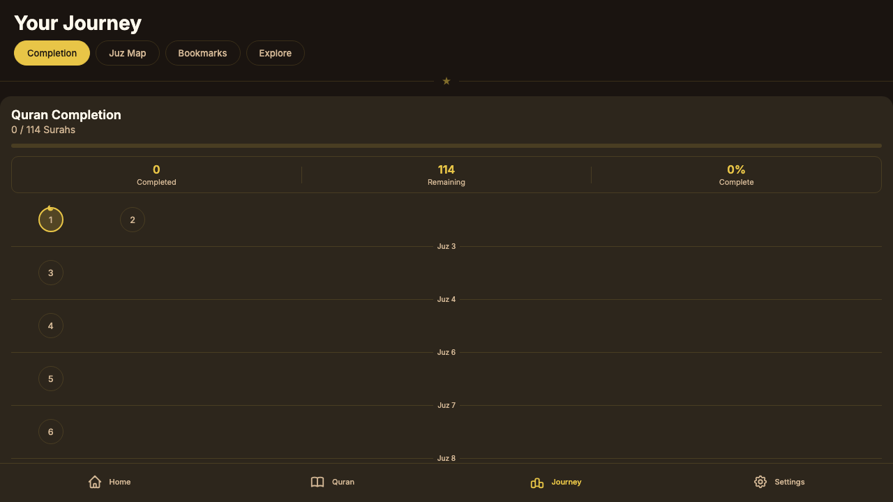
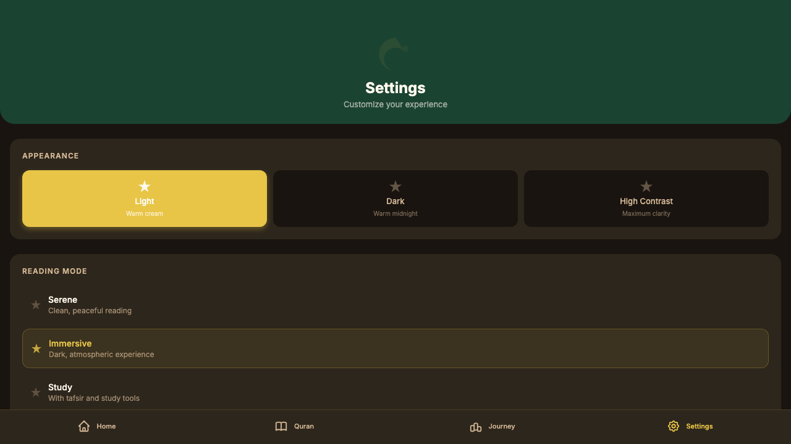

<h1 align="center">نور</h1>

<h3 align="center">Your Daily Quran Companion</h3>

<p align="center">
  Beautiful. Reverent. Personal.<br/>
  The Quran app that feels like opening a mushaf — not a productivity tool.
</p>

---

### See it in action

<p align="center">
  
  
  
</p>

<p align="center">
  
  
  
</p>

---

### Read the Quran your way

Noor gives you three reading modes designed around how you actually read:

- **Serene** — Clean, distraction-free. Just you and the Quran. Perfect for your daily reading on the commute.
- **Immersive** — Dark, atmospheric, with auto-advancing audio recitation. Made for deep reading at Fajr.
- **Study** — Side-by-side translation, inline notes, bookmarks. For your weekend tafsir sessions.

### Hear it beautifully recited

Choose from 6 world-renowned reciters including Mishary Al-Afasy, Abdul Basit, Sudais, Maher Al-Muaiqly, Husary, and Minshawi. Play ayah-by-ayah or let it flow continuously.

### Read in your language

Full Quran in Arabic with English and Urdu translations. Switch between languages anytime. Arabic text rendered in beautiful Amiri calligraphy with proper diacritical marks.

### Explore deeper

Noor includes a one-of-a-kind **Knowledge Explorer** — 222 Quranic entities (prophets, angels, places, themes, events, divine attributes) mapped across surahs. Follow the story of Yusuf (AS) across 7 surahs. Trace every mention of patience in the Quran. No other app does this.

### Track your journey

- See your Quran completion at a glance — all 114 surahs on one screen
- Track progress through 30 Juz with visual progress rings
- Save bookmarks with personal reflections
- Search any word across all 6,236 ayahs

### Share what moves you

Long-press any ayah to share a beautiful card with Arabic text, translation, and surah reference — perfect for WhatsApp, Instagram, or your family group chat.

### Designed with intention

Noor's warm cream, gold, and forest green palette was designed to feel reverent — like holding a real mushaf. No neon colors. No gamified badges. No guilt trips about missed days. Just beauty that invites you back.

Light mode, dark mode, and high contrast. Adjustable font sizes. Full accessibility support.

---

### Get started

```
git clone https://github.com/varunmoka7/noor-mobile.git
cd noor-mobile && npm install
npx expo start
```

Scan the QR code with [Expo Go](https://expo.dev/go) on your phone, or press `w` to open in your browser.

---

### Built with

Expo + React Native (iOS, Android, Web) | TypeScript | Amiri + Inter typography | Hand-crafted SVG Islamic ornaments

---

### Contributing

Noor is open source and welcomes contributions from anyone who cares about making the Quran more accessible. Whether you're a developer, designer, Arabic linguist, or Islamic studies student — there's a place for you here.

### License

MIT

### Acknowledgments

[Al-Quran Cloud API](https://alquran.cloud/api) for Quran text and audio | [Amiri](https://www.amirifont.org) typeface by Khaled Hosny | [Inter](https://rsms.me/inter/) typeface by Rasmus Andersson
