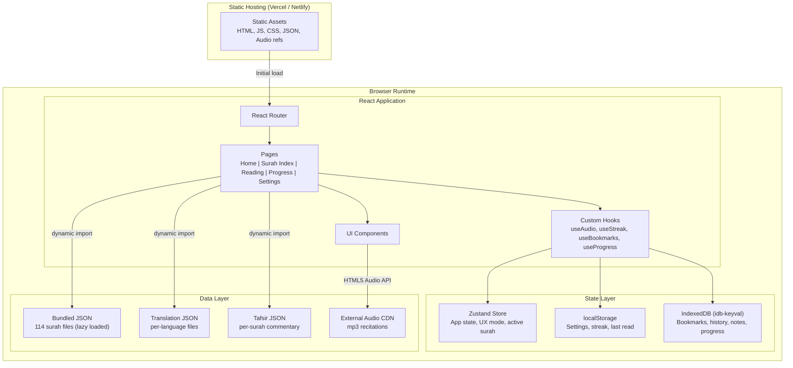
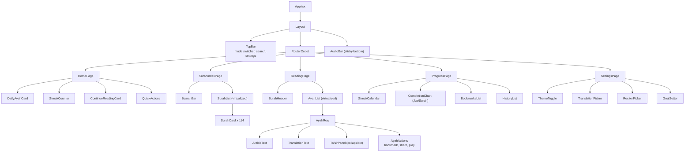
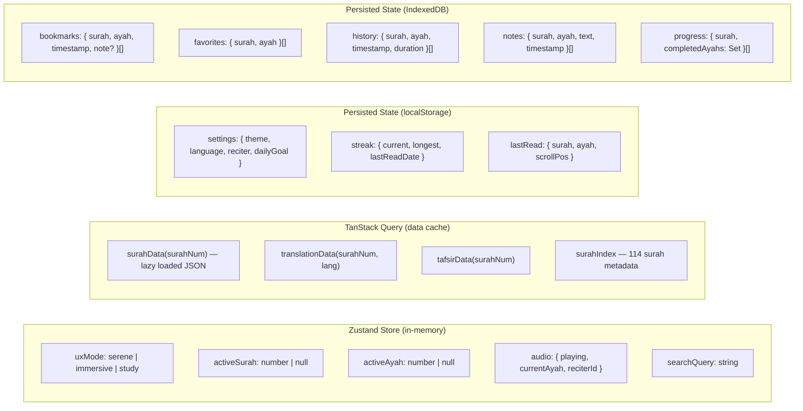
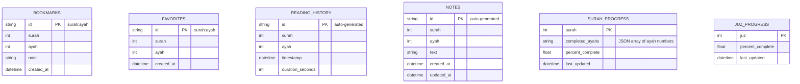
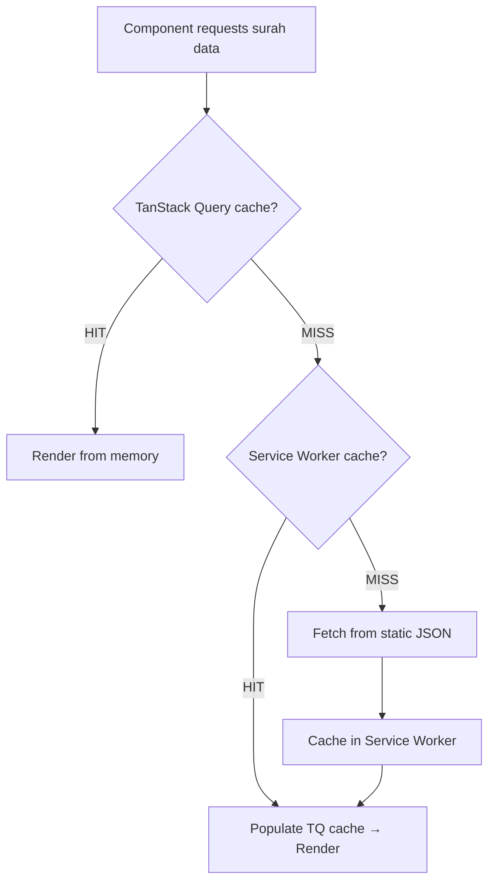
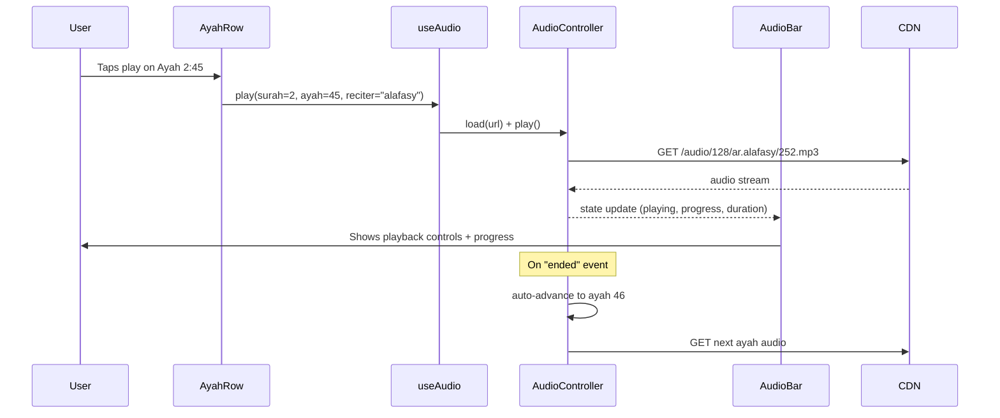
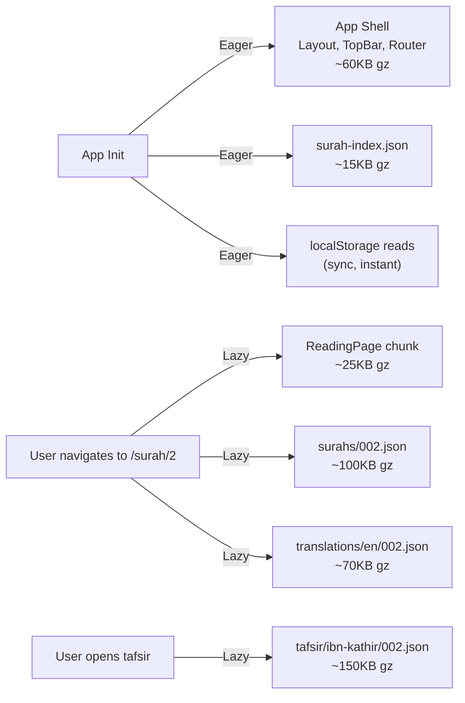
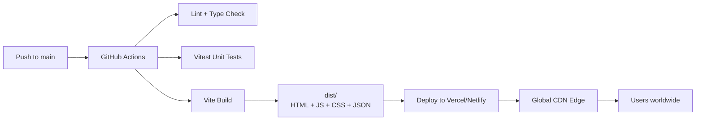
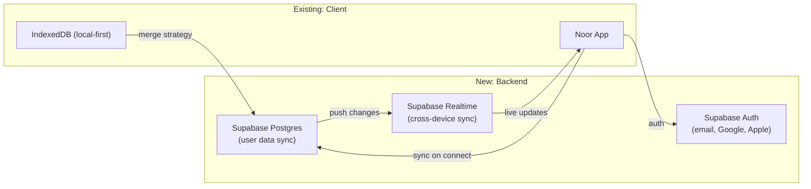

# Noor — Architecture Document

**Date:** 2026-03-24
**Status:** Draft
**Author:** Winston (System Architect)
**Source:** [Design Document](/docs/plans/2026-03-24-noor-quran-app-design.md)

---

## Table of Contents

1. [System Overview & High-Level Architecture](#1-system-overview--high-level-architecture)
2. [Frontend Architecture](#2-frontend-architecture)
3. [Data Layer](#3-data-layer)
4. [Audio Playback Architecture](#4-audio-playback-architecture)
5. [Project Structure](#5-project-structure)
6. [Key Technical Decisions & Trade-offs](#6-key-technical-decisions--trade-offs)
7. [Performance Considerations](#7-performance-considerations)
8. [Deployment Strategy](#8-deployment-strategy)
9. [Future Scalability](#9-future-scalability)

---

## 1. System Overview & High-Level Architecture

Noor is a **fully client-side** Quran content hub. There is no backend server. All Quran data ships as static JSON assets, and all user state lives in the browser via localStorage and IndexedDB. This makes the app fast, private, and deployable as a static site.

### High-Level Architecture Diagram



### Core Architectural Principles

| Principle | Implementation |
|-----------|---------------|
| **Zero backend** | All data bundled or fetched from CDN. No auth server, no database server. |
| **Offline-capable** | Service worker caches app shell + recently viewed surahs. |
| **Privacy-first** | All user data stays in the browser. Nothing leaves the device. |
| **Performance** | Lazy-load surah data on demand. Never load all 6,236 ayahs at once. |
| **Accessibility** | RTL support for Arabic, keyboard navigation, screen reader labels. |

---

## 2. Frontend Architecture

### 2.1 Component Tree



### 2.2 State Management

We use **Zustand** for global app state and **React Query (TanStack Query)** for data-fetching state. This keeps concerns separated: Zustand owns UI/session state, TanStack Query owns async data loading and caching.



**Why Zustand over Context API:** Zustand avoids the re-render cascading problem of React Context. When `uxMode` changes, only components that subscribe to `uxMode` re-render, not the entire tree. For an app with heavy Arabic text rendering, this matters.

**Why TanStack Query for data loading:** It gives us built-in caching, deduplication, stale-while-revalidate, and loading/error states without writing manual `useEffect` + `useState` patterns. When a user navigates to Surah Al-Baqarah, the JSON is fetched once and cached for the session.

### 2.3 Routing

React Router v7 with lazy-loaded route components.

```typescript
// routes.tsx
const routes = [
  { path: "/",           lazy: () => import("./pages/HomePage") },
  { path: "/surahs",     lazy: () => import("./pages/SurahIndexPage") },
  { path: "/surah/:id",  lazy: () => import("./pages/ReadingPage") },
  { path: "/progress",   lazy: () => import("./pages/ProgressPage") },
  { path: "/settings",   lazy: () => import("./pages/SettingsPage") },
];
```

Route params drive data loading: `/surah/2` triggers a TanStack Query for `surah-002.json`. The reading position is restored from localStorage on mount.

### 2.4 UX Mode System

The three UX modes (Serene, Immersive, Study) are implemented as a **CSS class on the root layout** combined with **Tailwind variants** and **conditional component rendering**.

```
Mode: Serene     → Light warm tones, minimal UI, large Arabic text, no tafsir panel
Mode: Immersive  → Dark background, ambient audio controls, full-screen reading, no chrome
Mode: Study      → Side panels for tafsir + notes, bookmark toolbar, split view
```

Implementation approach:
- `<Layout className={`mode-${uxMode}`}>` sets the root class.
- Tailwind config defines custom variants: `serene:`, `immersive:`, `study:`.
- Components conditionally render panels: `{uxMode === 'study' && <TafsirPanel />}`.
- Transitions between modes use `framer-motion` layout animations.

---

## 3. Data Layer

### 3.1 Local JSON Structure

All Quran data is **pre-processed at build time** and split into per-surah files for on-demand loading. A single metadata index file loads on app init.

```
public/data/
├── surah-index.json              # 114 entries, ~15KB gzipped
├── surahs/
│   ├── 001.json                  # Al-Fatiha (7 ayahs)
│   ├── 002.json                  # Al-Baqarah (286 ayahs)
│   ├── ...
│   └── 114.json                  # An-Nas (6 ayahs)
├── translations/
│   ├── en/
│   │   ├── 001.json
│   │   ├── ...
│   │   └── 114.json
│   ├── ur/                       # Urdu
│   ├── fr/                       # French
│   └── id/                       # Indonesian
└── tafsir/
    ├── ibn-kathir/
    │   ├── 001.json
    │   └── ...
    └── jalalayn/
        ├── 001.json
        └── ...
```

**surah-index.json** (loaded on app init):

```json
[
  {
    "number": 1,
    "name_arabic": "الفاتحة",
    "name_english": "Al-Fatiha",
    "name_translation": "The Opening",
    "revelation_type": "meccan",
    "ayah_count": 7,
    "juz": [1],
    "page_start": 1
  }
]
```

**surahs/001.json** (loaded on navigation):

```json
{
  "number": 1,
  "bismillah": null,
  "ayahs": [
    {
      "number": 1,
      "number_in_surah": 1,
      "text": "بِسْمِ اللَّهِ الرَّحْمَٰنِ الرَّحِيمِ",
      "juz": 1,
      "page": 1,
      "audio": {
        "mishary": "https://cdn.islamic.network/quran/audio/128/ar.alafasy/1.mp3",
        "husary": "https://cdn.islamic.network/quran/audio/128/ar.husary/1.mp3"
      }
    }
  ]
}
```

### 3.2 IndexedDB Schema

We use the `idb-keyval` library for simple key-value access and a thin wrapper for structured data.



**localStorage keys** (small, frequently accessed values):

| Key | Type | Purpose |
|-----|------|---------|
| `noor:settings` | JSON | Theme, language, reciter, daily goal |
| `noor:streak` | JSON | `{ current, longest, lastReadDate }` |
| `noor:lastRead` | JSON | `{ surah, ayah, scrollPosition, timestamp }` |
| `noor:dailyAyah` | JSON | `{ surah, ayah, date }` — cached daily ayah |

**Why split localStorage and IndexedDB:** localStorage is synchronous and fast for small reads (settings, streak check on app load). IndexedDB is async but handles larger datasets (hundreds of bookmarks, full reading history) without blocking the main thread.

### 3.3 Caching Strategy



Three cache layers:
1. **TanStack Query in-memory cache** — instant for same-session re-visits. `staleTime: Infinity` since Quran data is immutable.
2. **Service Worker (Workbox)** — caches fetched JSON files for offline access. Uses `CacheFirst` strategy for data files, `StaleWhileRevalidate` for the app shell.
3. **Browser HTTP cache** — JSON files served with `Cache-Control: public, max-age=31536000, immutable` since content is versioned by filename.

---

## 4. Audio Playback Architecture

Audio is handled through a **singleton controller** exposed via a React context and custom hook. The HTML5 `Audio` API is sufficient — no need for Howler.js or other libraries.

### Audio Flow



### AudioController Design

```typescript
// Singleton — one Audio instance for the entire app
class AudioController {
  private audio: HTMLAudioElement;
  private subscribers: Set<(state: AudioState) => void>;

  // State
  currentSurah: number | null;
  currentAyah: number | null;
  playing: boolean;
  progress: number;    // 0-1
  duration: number;    // seconds
  reciterId: string;

  // Methods
  play(surah: number, ayah: number, reciter: string): void;
  pause(): void;
  resume(): void;
  seekTo(position: number): void;
  setPlaybackRate(rate: number): void;
  playRange(surah: number, fromAyah: number, toAyah: number): void;
  
  // Auto-advance
  private onEnded(): void;   // advance to next ayah or stop at surah end
  
  // Subscriptions (for React binding)
  subscribe(callback: (state: AudioState) => void): () => void;
}
```

**useAudio hook** wraps the controller with `useSyncExternalStore` for tear-free React integration.

### Audio Preloading

When the user plays Ayah N, we **preload Ayah N+1** in a hidden `Audio` element. This eliminates the gap between consecutive ayahs during continuous playback. Only one ayah is preloaded ahead to conserve bandwidth.

### Audio CDN

We use the free **Islamic Network CDN** (`cdn.islamic.network`) which provides:
- Multiple reciters (Mishary Rashid Alafasy, Mahmoud Khalil Al-Husary, etc.)
- 128kbps MP3 files (~30-90KB per ayah)
- Reliable uptime, no API key required

If the CDN is unavailable, the audio controls gracefully degrade to a disabled state with a "Audio unavailable offline" message.

---

## 5. Project Structure

```
noor/
├── index.html
├── vite.config.ts
├── tailwind.config.ts
├── tsconfig.json
├── package.json
│
├── public/
│   ├── data/
│   │   ├── surah-index.json
│   │   ├── surahs/              # 114 files
│   │   ├── translations/        # per-language, per-surah
│   │   └── tafsir/              # per-source, per-surah
│   ├── fonts/
│   │   ├── amiri/               # Arabic serif font
│   │   └── inter/               # UI font
│   └── icons/                   # favicons, PWA icons
│
├── src/
│   ├── main.tsx                 # entry point
│   ├── App.tsx                  # router + providers
│   │
│   ├── pages/
│   │   ├── HomePage.tsx
│   │   ├── SurahIndexPage.tsx
│   │   ├── ReadingPage.tsx
│   │   ├── ProgressPage.tsx
│   │   └── SettingsPage.tsx
│   │
│   ├── components/
│   │   ├── layout/
│   │   │   ├── Layout.tsx
│   │   │   ├── TopBar.tsx
│   │   │   └── AudioBar.tsx
│   │   ├── home/
│   │   │   ├── DailyAyahCard.tsx
│   │   │   ├── StreakCounter.tsx
│   │   │   ├── ContinueReadingCard.tsx
│   │   │   └── QuickActions.tsx
│   │   ├── surah/
│   │   │   ├── SurahList.tsx
│   │   │   ├── SurahCard.tsx
│   │   │   └── SearchBar.tsx
│   │   ├── reading/
│   │   │   ├── AyahList.tsx
│   │   │   ├── AyahRow.tsx
│   │   │   ├── ArabicText.tsx
│   │   │   ├── TranslationText.tsx
│   │   │   ├── TafsirPanel.tsx
│   │   │   └── AyahActions.tsx
│   │   ├── progress/
│   │   │   ├── StreakCalendar.tsx
│   │   │   ├── CompletionChart.tsx
│   │   │   ├── BookmarksList.tsx
│   │   │   └── HistoryList.tsx
│   │   └── shared/
│   │       ├── Button.tsx
│   │       ├── Modal.tsx
│   │       ├── Badge.tsx
│   │       └── Skeleton.tsx
│   │
│   ├── hooks/
│   │   ├── useAudio.ts
│   │   ├── useStreak.ts
│   │   ├── useBookmarks.ts
│   │   ├── useProgress.ts
│   │   ├── useReadingHistory.ts
│   │   ├── useSettings.ts
│   │   ├── useSurahData.ts       # TanStack Query wrapper
│   │   ├── useDailyAyah.ts
│   │   └── useUXMode.ts
│   │
│   ├── store/
│   │   └── appStore.ts           # Zustand store
│   │
│   ├── lib/
│   │   ├── audio-controller.ts   # AudioController singleton
│   │   ├── db.ts                 # IndexedDB wrapper (idb-keyval)
│   │   ├── storage.ts            # localStorage helpers with type safety
│   │   ├── streak-engine.ts      # streak calculation logic
│   │   ├── daily-ayah.ts         # deterministic daily ayah picker
│   │   ├── search.ts             # client-side surah/ayah search
│   │   └── constants.ts          # reciter list, language list, etc.
│   │
│   ├── types/
│   │   ├── surah.ts
│   │   ├── ayah.ts
│   │   ├── user.ts
│   │   └── audio.ts
│   │
│   └── styles/
│       ├── globals.css           # Tailwind directives + Arabic font-face
│       ├── modes.css             # UX mode overrides (serene, immersive, study)
│       └── arabic.css            # Arabic typography rules
│
├── scripts/
│   └── build-data.ts             # pre-process Quran JSON from source APIs
│
└── sw.ts                         # service worker (Workbox)
```

---

## 6. Key Technical Decisions & Trade-offs

### Decision 1: Bundled JSON vs. API

| | Bundled JSON | Remote API |
|-|-------------|------------|
| **Pros** | Zero latency, offline by default, no server cost, total privacy | Smaller initial bundle, always up-to-date |
| **Cons** | Larger deploy size (~15-25MB uncompressed), updates require redeploy | Requires backend, latency, costs, privacy concerns |
| **Decision** | **Bundled JSON.** The Quran text is immutable. Per-surah splitting + lazy loading keeps individual page loads small. CDN gzip reduces effective transfer to ~3-5MB for the full dataset. |

### Decision 2: Zustand vs. Redux vs. Context

| | Zustand | Redux Toolkit | React Context |
|-|---------|--------------|---------------|
| **Pros** | Tiny (1KB), simple API, selector-based re-renders | Ecosystem, devtools, middleware | Built-in, no deps |
| **Cons** | Smaller ecosystem | Boilerplate, heavier | Re-render cascading on large trees |
| **Decision** | **Zustand.** For a client-only app with moderate state complexity, Zustand's simplicity and performance characteristics are the right fit. Redux is overkill here. Context would cause performance issues with Arabic text re-rendering. |

### Decision 3: Virtualized Lists vs. Pagination

| | Virtualization | Pagination |
|-|---------------|------------|
| **Pros** | Seamless scroll, feels native | Simple implementation |
| **Cons** | Complex scroll restoration, RTL edge cases | Breaks reading flow |
| **Decision** | **Virtualization with `@tanstack/react-virtual`.** Surah Al-Baqarah has 286 ayahs with Arabic text, translation, and tafsir. Rendering all DOM nodes would be catastrophic. Virtualization keeps DOM node count under ~30 regardless of surah length. |

### Decision 4: IndexedDB Library

| | idb-keyval | Dexie.js | Raw IndexedDB |
|-|-----------|---------|--------------|
| **Pros** | Tiny (600B), simple get/set | Full query support, indexes | No dependency |
| **Cons** | No indexes or queries | 45KB, heavier | Verbose callback API |
| **Decision** | **idb-keyval for simple stores + a thin wrapper for indexed queries.** Most access patterns are simple key lookups (get bookmark by surah:ayah). For the few cases where we need range queries (reading history by date), we write a small wrapper over the raw API. |

### Decision 5: Service Worker Strategy

| | Workbox | Custom SW | No SW |
|-|---------|----------|-------|
| **Pros** | Battle-tested caching strategies, precaching | Full control | Simplicity |
| **Cons** | Added build config | Easy to get wrong | No offline support |
| **Decision** | **Workbox (via vite-plugin-pwa).** Precache the app shell + surah-index.json. Runtime cache surah data files with CacheFirst. This gives offline reading for previously viewed surahs with minimal config. |

---

## 7. Performance Considerations

### 7.1 Bundle Size Budget

| Chunk | Target (gzipped) |
|-------|------------------|
| Initial JS (app shell) | < 80KB |
| Per-page route chunk | < 30KB each |
| Surah data file (largest: Al-Baqarah) | < 120KB |
| Translation file (largest) | < 80KB |
| Total first-load transfer | < 150KB |

### 7.2 Lazy Loading Strategy



### 7.3 Arabic Text Rendering

Arabic text is the most expensive rendering operation in this app. Strategies:

1. **Use system Arabic fonts as fallback.** Load the custom Amiri font asynchronously with `font-display: swap`. Arabic text is readable in the system font during the swap window.
2. **Virtualize the ayah list.** Never render more than ~20 visible ayahs at once.
3. **Avoid layout shifts.** Set explicit `min-height` on AyahRow based on estimated line count. Arabic text with diacritics (tashkeel) is taller than Latin text.
4. **`content-visibility: auto`** on off-screen ayah containers as a progressive enhancement.

### 7.4 Large Dataset Handling

The full Quran is 6,236 ayahs. We never hold all of them in memory at once.

- **Surah-level granularity.** Each surah is a separate JSON file. Only the active surah is loaded.
- **TanStack Query garbage collection.** `gcTime: 5 * 60 * 1000` (5 minutes). After navigating away from a surah for 5 minutes, its data is eligible for garbage collection.
- **Search uses the index file.** Surah search operates on the 114-entry index (always in memory). Full-text ayah search is deferred to a future release (requires a prebuilt search index or Web Worker).

### 7.5 Perceived Performance

- **Skeleton screens** while surah data loads.
- **Optimistic streak updates.** Increment the streak counter instantly on navigation, persist async.
- **Prefetch next surah.** When the user is reading Surah 2, prefetch the metadata for Surah 3 so the transition feels instant.
- **Stale-while-revalidate** for the app shell via service worker — returning users see the cached app immediately.

---

## 8. Deployment Strategy

### Static Deployment Pipeline



### Build Configuration

```typescript
// vite.config.ts — key settings
export default defineConfig({
  build: {
    rollupOptions: {
      output: {
        manualChunks: {
          'vendor-react': ['react', 'react-dom'],
          'vendor-router': ['react-router'],
          'vendor-query': ['@tanstack/react-query'],
          'vendor-virtual': ['@tanstack/react-virtual'],
        },
      },
    },
  },
});
```

### Hosting Requirements

| Requirement | Detail |
|-------------|--------|
| **Hosting type** | Static file serving (no SSR) |
| **CDN** | Required — global audience |
| **Custom domain** | `noor.app` or similar |
| **HTTPS** | Mandatory (required for Service Worker) |
| **Headers** | `Cache-Control: immutable` on hashed assets; short TTL on `index.html` |
| **Redirects** | SPA fallback: all routes serve `index.html` |

### Recommended: Vercel

- Zero-config for Vite projects
- Automatic CDN distribution
- Preview deployments on PRs
- Free tier sufficient for launch

---

## 9. Future Scalability

This section documents what changes when Noor grows beyond a static client-side app.

### Phase 1: Current (Static Client-Side)

Everything described in this document. No backend. Ship it.

### Phase 2: Add User Accounts & Sync

**Trigger:** Users want to sync progress across devices.



**What changes:**
- Add Supabase client library (~10KB).
- IndexedDB remains the primary store (local-first). Supabase syncs in the background.
- Conflict resolution: last-write-wins for settings, union-merge for bookmarks/history.
- Quran data JSON files remain static and bundled — never in the database.

**What stays the same:**
- All Quran data loading.
- Audio playback.
- UX modes and component tree.
- Offline functionality.

### Phase 3: Community Features

**Trigger:** Users want to share collections, join reading groups.

**What changes:**
- Add API routes (Supabase Edge Functions or a lightweight Express server).
- New data models: `ReadingGroup`, `SharedCollection`, `DailyChallenge`.
- New pages: Community, Groups, Leaderboard.
- Push notifications via Web Push API.

### Phase 4: Mobile App

**Trigger:** Need native features (background audio, widgets, notifications).

**What changes:**
- Wrap in Capacitor for iOS/Android.
- Replace Service Worker caching with native file system.
- Add native audio session handling for background playback.
- Same React codebase, minimal platform-specific code.

### Migration Guardrails

To ensure the current architecture does not block future phases:

1. **All persistence goes through hooks** (`useBookmarks`, `useProgress`, etc.). Swapping IndexedDB for Supabase means changing the hook internals, not the components.
2. **Data fetching goes through TanStack Query.** Swapping local JSON for API calls means changing the `queryFn`, not the components.
3. **Audio is abstracted behind AudioController.** Adding background playback means extending the controller, not touching the UI.
4. **No hardcoded storage calls in components.** Components call hooks. Hooks call `lib/db.ts` or `lib/storage.ts`. Only the lib layer touches IndexedDB/localStorage directly.

---

## Appendix A: Dependency List

| Package | Purpose | Size (gzipped) |
|---------|---------|----------------|
| `react` + `react-dom` | UI framework | ~42KB |
| `react-router` | Client routing | ~14KB |
| `zustand` | State management | ~1KB |
| `@tanstack/react-query` | Data fetching + caching | ~12KB |
| `@tanstack/react-virtual` | List virtualization | ~5KB |
| `idb-keyval` | IndexedDB wrapper | ~0.6KB |
| `framer-motion` | Animations + transitions | ~30KB |
| `vite-plugin-pwa` | Service worker generation | build-only |
| `tailwindcss` | Utility CSS | build-only |

**Total runtime JS budget: ~105KB gzipped** (before app code).

---

## Appendix B: Data Size Estimates

| Dataset | Files | Uncompressed | Gzipped |
|---------|-------|-------------|---------|
| Surah index | 1 | ~50KB | ~15KB |
| Arabic text (all surahs) | 114 | ~4MB | ~1.5MB |
| English translation | 114 | ~3MB | ~1MB |
| Tafsir (Ibn Kathir) | 114 | ~15MB | ~5MB |
| **Total** | **343** | **~22MB** | **~7.5MB** |

Users will never download all of this at once. On first visit, only the index + one surah + translation loads (~200KB). The service worker progressively caches surahs as they are read.

---

*This architecture is designed to ship fast as a static app while preserving clear upgrade paths for auth, sync, and native mobile. Every abstraction boundary (hooks, lib layer, data layer) exists to make future changes local, not global.*
